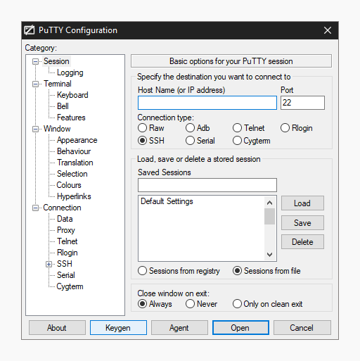
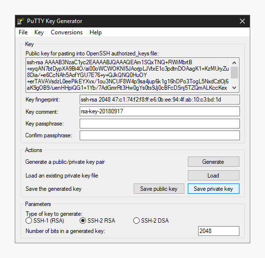

# Базовый ssh

ssh - программа для удаленного доступа к серверу.

Более подробно его изучение будет в аналогичной секции у продвинутого уровня. Сейчас нам нужно его установить и произвести подключение.

## В Linux
ssh по-умолчанию в большинстве дистрибутивов уже установлен, а если нет, то необходимо обратиться к документации для установки. Пакет должен называться openssh или аналогично, для установки может использоваться команда, например, apt install openssh.

После необходимо сгенерировать ключевую пару:
```
$ ssh-keygen
```
Будет запрошено место, куда сохранить ключ и пароль для этого ключа. Пароль можно не указывать, но можно и указать, чтобы дополнительно повысить безопасность.

Публичная часть ключа сохранится рядом с приватной, но будет иметь постфикс “.pub”.

Если требуется использовать нестандартный алгоритм шифрования, то ключом “-t” можно указать какой именно. Доступные можно узнать, используя ключ --help. Фрагмент вывода, который говорит об этом:
[-t dsa | ecdsa | ecdsa-sk | ed25519 | ed25519-sk | rsa]

При подключении к серверу в утилите ssh не обязательно указывать ключ, поскольку если тот был сохранен в ~/.ssh, то скорее всего сам ssh определит его.

Для подключения к серверу без указания ключа:
```
$ ssh user@ip
```
Где user - имя пользователя, а server это ip-адрес или домен сервера.

Для подключения к серверу с указанием ключом:
```
$ ssh -i '/путь/до/ключа’ user@server
```
При подключении может возникнуть требование ssh об указании прав на файл. Он должен быть доступен только пользователю, который является владельцем этого файла. Как работают права в Linux будет рассмотрено позднее, но сейчас достаточно выполнить следующую команду:
```
# chmod 700 ~/путь/до/ключа
```

## В Windows
Можно поступить аналогично Linux, если установлена компонента openssh.

https://learn.microsoft.com/ru-ru/windows-server/administration/openssh/openssh_install_firstuse?tabs=gui#install-openssh-for-windows

Если привычны графические приложения, то есть, например, termius и PuTTY. Использование последнего рассматривается далее.

Установить PuTTY можно, используя winget:
```
$ winget install PuTTY.PuTTY
```

Подробнее: https://learn.microsoft.com/ru-ru/windows/package-manager/winget/

Или же используя установщик с официального сайта: https://putty.org/


Для генерации ключа нужно открыть PuTTY Key Generator.



Выбрать алгоритм, нажать generate.


Программа запросит движения мыши в окне программы для создания достаточной энтропии, чтобы создать ключ.


После можно опционально добавить пароль (passphrase).

Key comment это имя ключа, лучше его заменить на имя компьютера, свое имя или свой ник.

Файлы нужно сохранить.



Теперь в Connection -> SSH -> Auth -> Credentials нужно указать приватный ключ и Session можно подключиться к серверу, указав ip-адрес или домен в верхнем поле и нажав “Open”. Уже в новом окне нужно указать имя подключаемого пользователя.

## Как подключится к нашему севреру

Для этого необходимо обратиться к Александру и передать ему или в форму предоставленную им публичную часть ключа (расширение .pub). После чего подключение на сервер может выглядеть следующим образом:

```
$ ssh username@server.genlab.llc
```

## Передача файлов файлов с помощью ssh
Вместе с ssh поставляется утилита scp, которая позволяет копировать файлы на сервер и с сервера, но нам потребуется только передать файл на сервер.

```
$ scp путь_до_файла имя_пользователя@домен_или_ip:/путь_до_места_сохранения_файла
```

# Базовый bash
bash - оболочка командной строки в Linux.

Она не единственная, но основная. Важно понимать, что в мире Linux крайне много вариантов утилит. Например, даже до самого bash был sh, а много кто ставит вместе bash оболочки вроде zsh, fish.

Для отработки действий в bash на практике можно использовать виртуальную машину в браузере:
https://copy.sh/v86/?profile=archlinux

Ещё там же есть Linux с графической оболочкой:
https://copy.sh/v86/?profile=dsl

Можно ещё поиграться с BSD дистрибутивами (там тоже bash, но это не Linux. Позднее в курс будет подробнее):
https://copy.sh/v86/?profile=freebsd
https://copy.sh/v86/?profile=openbsd

## Синтаксис примеров

В оформлении команд перед командой используются символы "$" и "#". Они показывают необходимые права для запуска команды. Для "$" достаточно прав обычного пользователя, а "#" указывает на то, что нужны права администратора (в linux такой пользователь называется root).

Для запуска команд от имени root необходимо либо сменить пользователя на root, что обычно делается утилитой su:
```
$ su root
Или в сокращённом виде:
$ su
В некоторых дистрибутивах (не Ubuntu и многие популярные) нужно использовать:
$ su-
```
В любом случае будет запрошен пароль root.

После её ввода пользователь сменится. Для выхода из этого состояния можно воспользоваться командой:
```
$ exit
Или поскольку мы в root пользователе...
# exit
Кроме того, ещё есть команда logout:
$ logout
```

Либо можно использовать утилиту sudo, которая выдаёт права root на запуск одной команды.
```
$ sudo command
```
Важно то, что sudo может запрашивать пароль самого пользователя, а не root и сама утилита sudo может быть настроена особым образом администратором сервера.

На серверах может быть отключен логин в root напрямую и тогда утилита su может не работать, поэтому можно сделать это так:
```
$ sudo su
```

На серверах обычно нет прав root совсем, ими владеет только администратор и необходимые действия на сервере от root-пользователя выполняются через запрос к нему, либо в виртуальном окружении о чём будет сильно позднее.

## Помощь

Существует утилита man, которая может вывести справку о многих командах. Например:
```
$ man echo
```
Выведет что-то вроде:
```
NAME
       echo - display a line of text

SYNOPSIS
       echo [SHORT-OPTION]... [STRING]...
       echo LONG-OPTION

DESCRIPTION
       Echo the STRING(s) to standard output.

       -n     do not output the trailing newline
...
```

Этим нужно пользоваться.

Кроме того, у команд обычно есть своя встроенная помощь. Например:
```
$ cat --help
Или
$ cat --h
Ещё встречается форма "-h", но конкретно cat её не понимает.
```

## Аргументы
Команда состоит из её вызова и передаваемых аргументов. Например, как в примере выше:
```
$ cat --help
```
Здесь "cat" это вызов команды, а "--help" её аргумент. Аргумент не обязательно должен содержать один или несколько "-" это просто всё, что следует после команды. В примере с sudo она воспринимает всё после как аргументы, но просто после их самостоятельно запускает от имент root-пользователя.

## Базовые команды
### pwd
```
$ pwd
```
Выведет текущий путь. Например, "/home/user" - домашняя директория пользователя user.

### ls
```
$ ls
```
Выведет файлы и директории в текущей директории.

```
$ ls -la
```
Частая форма вызова, которая дополнительно показывает больше информации о каждом файле и директории, а так же показывает скрытые (начинающиеся с .) файлы и директории.

В данном случае используются на самом деле два аргумента, а именно "-l" - для подробной информации и "-a", то есть all, то есть все для вывода скрытых файлов и директорий, но программа поддерживает такую удобную их запись.

### cd
```
$ cd dir
```
Позволяет перейти в необходимую директорию по имени, относительному или абсолютному пути.

Например, мы находимся в "/home/user". Такая запись это абсолютный путь. Находясь где угодно в неё можно попасть всегда используя команду:
```
$ cd /home/user
```
Если мы хотим попасть в директорию docs в "/home/user", то можно сделать аналогично, но написав "/home/user/docs", либо использовать имя "docs" или относительный путь "./docs":
```
$ cd /home/user/docs

Если находились в /home/user до этого. См. pwd
$ cd ./docs
$ cd docs
```

"." указывает на текущую директорию.

### touch
```
$ touch file
```

file - имя нового файла.

Позволяет создать пустой файл. Синтаксис относительных и абсолютных путей тоже работает.

### mkdir
```
$ mkdir dir
```

dir - имя новой директории.

Позволяет создавать директории.

### cp
```
& cp from to
```

from - исходный файл или директория.
to - копия файла или директории.

Позволяет скопировать файл или директорию.

### mv
```
& cp from to
```

Позволяет переместить файл или директорию.

### rm
```
Для удалния файла:
$ rm something
Для удаления директории:
$ rm -r something
```

Позволяет удалить файл или директорию

### echo
```
$ echo 1
```
Выведет 1.

Позволяет произвести вывод на экран.

### cat
```
$ cat file
```

Позволяет вывести содержимое файла.

### nano
```
$ nano file
```

Позволяет редактировать файлы. Снизу будет выведена панель с информацией о специальных действиях. Например, Crtl + x используется для выхода.

# Практикум python + mamba

https://mamba.readthedocs.io/en/latest/index.html
https://mamba.readthedocs.io/en/latest/user_guide/mamba.html
