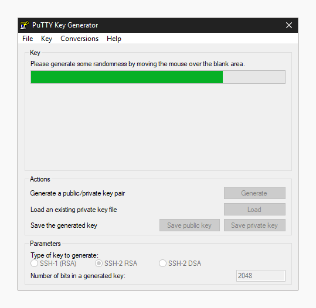
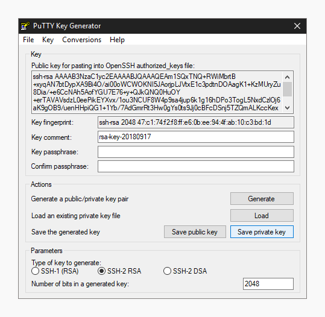

# Базовый ssh

ssh - программа для удаленного доступа к серверу.

Более подробно его изучение будет в аналогичной секции у продвинутого уровня. Сейчас нам нужно его установить и произвести подключение.

## В Linux
ssh по-умолчанию в большинстве дистрибутивов уже установлен, а если нет, то необходимо обратиться к документации для установки. Пакет должен называться openssh или аналогично, для установки может использоваться команда, например, apt install openssh.

После необходимо сгенерировать ключевую пару:
```
$ ssh-keygen
```
Будет запрошено место, куда сохранить ключ и пароль для этого ключа. Пароль можно не указывать, но можно и указать, чтобы дополнительно повысить безопасность.

Публичная часть ключа сохранится рядом с приватной, но будет иметь постфикс “.pub”.

Если требуется использовать нестандартный алгоритм шифрования, то ключом “-t” можно указать какой именно. Доступные можно узнать, используя ключ --help. Фрагмент вывода, который говорит об этом:
[-t dsa | ecdsa | ecdsa-sk | ed25519 | ed25519-sk | rsa]

При подключении к серверу в утилите ssh не обязательно указывать ключ, поскольку если тот был сохранен в ~/.ssh, то скорее всего сам ssh определит его.

Для подключения к серверу без указания ключа:
```
$ ssh user@ip
```
Где user - имя пользователя, а server это ip-адрес или домен сервера.

Для подключения к серверу с указанием ключом:
```
$ ssh -i '/путь/до/ключа’ user@server
```
При подключении может возникнуть требование ssh об указании прав на файл. Он должен быть доступен только пользователю, который является владельцем этого файла. Как работают права в Linux будет рассмотрено позднее, но сейчас достаточно выполнить следующую команду:
```
# chmod 700 ~/путь/до/ключа
```

## В Windows
Можно поступить аналогично Linux, если установлена компонента openssh.

https://learn.microsoft.com/ru-ru/windows-server/administration/openssh/openssh_install_firstuse?tabs=gui#install-openssh-for-windows

Если привычны графические приложения, то есть, например, termius и PuTTY. Использование последнего рассматривается далее.

Установить PuTTY можно, используя winget:
```
$ winget install PuTTY.PuTTY
```

Подробнее: https://learn.microsoft.com/ru-ru/windows/package-manager/winget/

Или же используя установщик с официального сайта: https://putty.org/


Для генерации ключа нужно открыть PuTTY Key Generator.


Выбрать алгоритм, нажать generate.


Программа запросит движения мыши в окне программы для создания достаточной энтропии, чтобы создать ключ.



После можно опционально добавить пароль (passphrase).

Key comment это имя ключа, лучше его заменить на имя компьютера, свое имя или свой ник.

Файлы нужно сохранить.



Теперь в Connection -> SSH -> Auth -> Credentials нужно указать приватный ключ и Session можно подключиться к серверу, указав ip-адрес или домен в верхнем поле и нажав “Open”. Уже в новом окне нужно указать имя подключаемого пользователя.

## Как подключится к нашему севреру

Для этого необходимо обратиться к Александру и передать ему или в форму предоставленную им публичную часть ключа (расширение .pub). После чего подключение на сервер может выглядеть следующим образом:

```
$ ssh username@server.genlab.llc
```

## Передача файлов файлов с помощью ssh
Вместе с ssh поставляется утилита scp, которая позволяет копировать файлы на сервер и с сервера, но нам потребуется только передать файл на сервер.

```
$ scp путь_до_файла имя_пользователя@домен_или_ip:/путь_до_места_сохранения_файла
```
