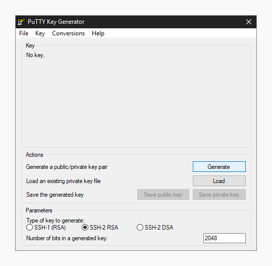

# Как работает ssh

ssh (Secure Shell) — протокол и программа, которые позволяют организовать удаленный доступ к серверам. Функционал на этом не ограничивается, но в рамках работы пользователи используют его именно для доступа к серверу и дальнейшей работы на нём.

Утилита ssh и связанные с ней в текущем виде предоставляется пакетом программ openssh, который так назван из-за того, что разработка ведётся в рамках проекта OpenBSD - свободной операционной системы BSD, нацеленной на максимальную безопасность.

Подробнее: https://ru.wikipedia.org/wiki/SSH

Безопасность это краеугольный камень для нас, поэтому у нас для доступа на сервера используется не пароль, а ключевая пара.

В криптографии есть два типа шифрования:

* Симметричное
Имея ключ (он всего один) можно зашифровать и расшифровать сообщение. Простым и понятным примером будет шифр цезаря. Просто сместим каждую букву сообщения алфавита на N и получим зашифрованное сообщение, а для расшифровки нужно сместить на -N. В данном случае N это и есть ключ.

Конкретно у шифра цезаря есть проблемы, например, крайне легко узнать ключ, имея достаточно большое зашифрованное сообщение, используя частотный анализ, но есть куда более совершенные методы, которые лишены этой проблемы, но принцип этих методов схож, поэтому это крайне хорошая демонстрация. В общем же у симметричного шифрования возникает проблема с передачей такого ключа, если мы не можем обеспечить безопасность передачи такого ключа, то применить его невозможно, злоумышленник попросту может его перехватить, но в общем случае симметричное шифрование куда быстрее.

Подробнее: https://ru.wikipedia.org/wiki/Симметричные_криптосистемы

* Асимметричное
Есть публичный и приватный ключ. Публичный можно передавать по открытому каналу и он используется для шифрования сообщений, а приватный используется для расшифровки.

Конкретный простой примера алгоритма асимметричного шифрования придумать достаточно сложно, но суть в том, что публичный ключ можно передать по открытому каналу, а после уже собеседник зашифрует им сообщение, а автор ключа расшифрует его приватным ключом. Прослушивая канал не получится прочитать содержимое и теперь нужно, чтобы злоумышленник полностью владел каналом, тогда он может подменить публичный ключ своим, но если в первый раз мы точно получили нужный публичный ключ, то мы можем его запомнить и если нам дадут другой, то мы сразу поймем, что кто-то встал по-середине. Эту особенность увидим позднее.

Чтобы сервер мог проверить нас, нам нужно ему передать публичный ключ, а приватный оставить в безопасном месте.

Подробнее: https://ru.wikipedia.org/wiki/Криптосистема_с_открытым_ключом

В ssh используется оба варианта шифрования. Конкретно при подключении используется асимметричное, но после установления соединения для ускорения соединения используется симметричное шифрование с периодическим обновлением ключа.
